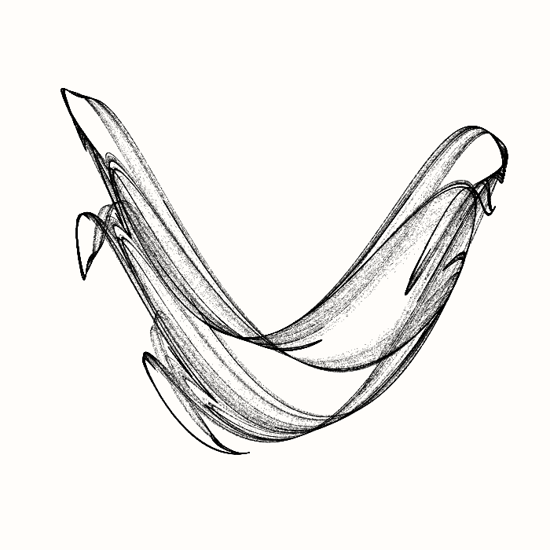

# Physarum - Mathematical Art

The name of this repository comes from the slime mold  _Physarum polycephalum_, which grows in algorithmically interesting ways.

### CairoPainter

This python class is used to plot common shapes (lines, circles, rectangles, etc) on an SVG canvas using the PyCairo library.

## Attractors

Code that draws attractors including trigonometric attractors and the aizawa attractor.

## Chaos Game

The chaos game can be used to generate many different fractals.

## Rosettes

This code produces graphs of functions of the complex plane that create rosetts that look like flowers.
